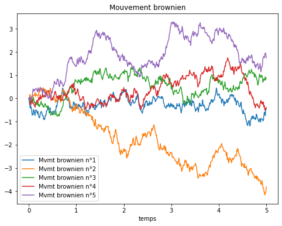
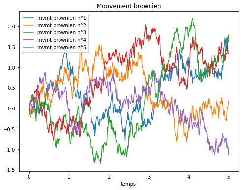
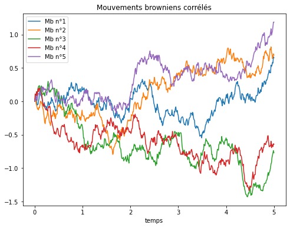
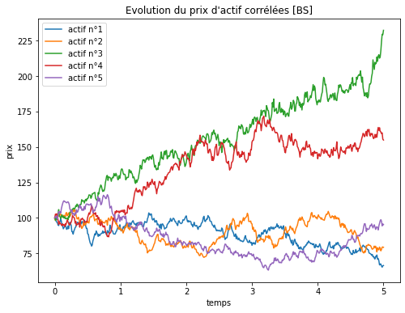

# Mini-projet Monte Carlo - Options Basket


```python
import numpy as np
import matplotlib.pyplot as plt
```


```python
### paramètres "physique"
d = 5
T = 5
r = 0.1
S0 = 100
sigma = 0.4
rho = 0.2

### paramètres "numériques"
N = 100*T
Mc = 10000
a = 1/d
```

## Construction du mouvement brownien
Ici on va s'intéresser à comment construire le mouvement brownien. En effet étant le processus stochastique phare, il est nécessaire de savoir générer une tractoire avant de pouvoir penser à faire autre chose. Pour ça on utiliser la définition sous forme de processus gaussien.    
En effet on sait que $W$ est un mouvement brownien si et seulement si il s'agit d'un processus gaussien continu centrée et de fonction de covariance $K(s,t) = min(s,t)$.   

Ici on va découper notre intervalle $[0,T]$ avec une suite $(t_{i})_{ \{0 \leq i \leq N\}}$ tel que $0 \leq t_{0} < t_{1} < ... < t_{N} = T$. Donc générer un mouvement brownien reviens à générer un vecteur aléatoire $W = \bigl( W_{t_{0}} , ... , W_{t_{N}} \bigr)$. tel que le vecteur soit gaussien et de matrice de variance covariance $\Gamma$ avec $\Gamma_{i,j} = min(t_{i},t_{j})$.   
Maintenant il faut penser à comment générer ce vecteur. L'idée la plus simple et de se dire que comme W est un vecteur gaussien centré, il existe une matrice $A \in \mathbb{M}_{N+1}(R)$ tel que $ W = AZ $ avec $Z \sim \mathcal{N}(0,I_{N+1})$. 
    
Maintenant on cherche donc A tel que $A A^{T} = \Gamma$. Etant donné que $\Gamma$ est symétrique définie positive (si on ne compte pas la première ligne et la première colonne) alors une idée naturelle est de déterminer $A$ grâce à l'algorithme de Cholesky.


```python
## Ici on construit la matrice de variance-covariance du mouvement brownien
def MatBrownien(t,N):
    Mat = np.zeros( (N+1,N+1) )
    for i in range(1,N+1):
        for j in range(1,N+1):
            Mat[i][j] = min(t[i],t[j])
    return Mat 

## Ici on crée le vecteur W qui est censé représenter un mouvement brownien sur l'intervalle [0,T]
def MvmtBrownien(T,N):
    h = T/N
    W = np.random.normal(0,1, size = N+1)
    t = np.array([i*h for i in range(N+1)])
    Mat = MatBrownien(t,N)
    A = np.linalg.cholesky(Mat[1:,1:])
    B = np.zeros((N+1,N+1))
    B[1:,1:] = A
    W = np.dot(B,W)
    return (t,W)
```


```python
plt.subplots(figsize=(8,6))
for i in range(d):
    t,W = MvmtBrownien(T,N)
    plt.plot(t,W, label = "Mvmt brownien n°{}".format(i+1))
plt.xlabel("temps")
plt.title("Mouvement brownien")
plt.legend()
plt.show()
```


    

    


On a vu comment générer un mouvement brownien. Bien sûr on peut généraliser cette génération en créant une matrice de mouvements browniens indépendants tel que chaque ligne corresponde à un mouvement brownien.   
i.e : Si on appelle $\mathbb{G}$ cette matrice, on a $\mathbb{G}_{i,j} = W_{t_{j}}^{i}$


```python
def dMouvementBrownien(d,T,N):
    h = T/N
    W = np.random.normal(0,1, size = (d,N+1))
    t = np.array([i*h for i in range(N+1)])
    Mat = MatBrownien(t,N)
    A = np.linalg.cholesky(Mat[1:,1:])
    B = np.zeros((N+1,N+1))
    B[1:,1:] = A
    for i in range(d):
        W[i] = np.dot(B,W[i])
    return (t,W)
```


```python
t, W = dMouvementBrownien(d,T,N)
plt.subplots(figsize=(8,6))
for i in range(5):
    plt.plot(t,W[i], label = "mvmt brownien n°{}".format(i+1))
plt.xlabel("temps")
plt.title("Mouvement brownien")
plt.legend()
plt.show()
```


    

    


## Construction de d-mouvements browniens corrélés
Maintenant qu'on sait générer d-mouvement brownien, on s'intéresse à comment réussir à les corréler selon nos envies.   
On souhaite qu'ils soient tous corrélés du même facteur $\rho$.   
i.e : $\forall (i,j) \in [1,d]$ tel que $ i \ne j$ 
$$
\begin{equation*}
    \rho = \frac{ Cov(W_{t}^{i} , W_{t}^{j}) }{\sigma_{i} \sigma_{j} }
\end{equation*}
$$
Comme cette condition est vrai $\forall t \in \mathbb{R}^{+}$, alors elle est aussi vérifié à chaque instant de notre discrétisation temporelle.    
On peut donc considérer un instant $t_{k}$ de notre discrétisation ainsi qu'un vecteur aléatoire $Z_{t_{k}} = \bigl( W_{t_{k}}^{1}, ... , W_{t_{k}}^{d} \bigr)$. Il s'agit d'un vecteur gaussien centré de matrice de variance covariance $t_{k} I_{d}$.    
Notre objectif est que connaissant ce vecteur $Z_{t_{k}}$, on veut générer un vecteur $Z^{'}_{t_{k}}$ qui soit de matrice de variance covariance $\Gamma_k$ tel que : 
$$
\Gamma_k = \begin{pmatrix}
\sigma_{1}^{2} & \rho \sigma_{1} \sigma_{2} & \cdots & \rho \sigma_{1} \sigma_{d} \\
\rho \sigma_{1} \sigma_{2} & \sigma_{2}^{2} & \cdots & \rho \sigma_{2} \sigma_{d} \\
\vdots & \vdots & \ddots & \vdots \\
\rho \sigma_{1} \sigma_{d} & \rho \sigma_{2} \sigma_{d} & \cdots & \sigma_{d}^{2}
\end{pmatrix}
$$
Donc on va chercher une matrice $A_{k}$ tel que $Z^{'}_{t_{k}} = A_{k} Z_{t_{k}}$. On en déduit donc la condition suivante sur $A_{k}$ :
$$
\begin{equation*}
     A_{k} t_{k} I_{d} A_{k}^{T} = t_{k} A_{k} A_{k}^{T} = \Gamma_{k} 
\end{equation*}
$$
En posant $B_{k} = \sqrt{t_{k}} A_{k}$, on trouve que $\Gamma_{k} = B_{k} B_{k}^{T}$. 
Si on arrive à montrer qu'une telle décomposition de $\Gamma_{k}$ existe, on pourra donc calculer $B_{k}$ à partir de de $\Gamma_{k}$ et $A_{k}$ à partir de $B_{k}$ 

### Conditions sur $\rho$
Pour appliquer Cholesky sur $\Gamma_{k}$ il y'a des conditions à vérifier. La première étant que la matrice soit symétrique ce qui est (par déf de $\Gamma_{k}$ ) le cas. La seconde est que la matrice soit définie positive ce qui peut poser problème.   
En effet comme nous sommes dans un cas particulier où les corrélatations $\rho$ entre les actifs sont les mêmes, on se retrouve avec $\sigma_{1} = \sigma_{2} = ... = \sigma_{d} = \sigma $, on se retrouve avec la matrice suivante : 
$$
\Gamma_k = \begin{pmatrix}
\sigma^{2} & \rho \sigma^{2} & \cdots & \rho \sigma^{2} \\
\rho \sigma^{2} & \sigma^{2} & \cdots & \rho \sigma^{2} \\
\vdots & \vdots & \ddots & \vdots \\
\rho \sigma^{2} & \rho \sigma^{2} & \cdots & \sigma^{2}
\end{pmatrix} = \sigma^{2} \begin{pmatrix}
1 & \rho  & \cdots & \rho  \\
\rho  & 1 & \cdots & \rho  \\
\vdots & \vdots & \ddots & \vdots \\
\rho  & \rho  & \cdots & 1
\end{pmatrix} 
$$
On se rend donc très vite compte que selon les valeurs de $\rho$ il sera impossible d'avoir toutes les valeurs propres de $\Gamma_{k}$ strictement positives.   
Comme la somme des lignes est toujours la même et vaut $ 1 + (d-1) \rho $, on a $ \sigma^{2}( 1 + (d-1) \rho)$ qui est une valeur propre de multiplicité au moins une. Comme on veut que cette valeur propre soit stricement positive, on trouve que :
$$
\begin{equation*}
    \rho > \frac{-1}{d-1}
\end{equation*}
$$
Maintenant si on s'intéresse à la matrice $\Gamma_{k} - \sigma^{2} (1-\rho) I_{d}$, on voit bien qu'elle est de rang 1. Donc $\sigma^{2} (1-\rho)$ est une valeur propre de $\Gamma_{k}$ de multiplicité d-1. De la même façon, comme on veut que cette valeur propre soit strictement positive, on trouve que :
$$
\begin{equation*}
    \rho < 1
\end{equation*}
$$
Donc finalement pour pouvoir appliquer Cholesky à $\Gamma_{k}$, il faudra avoir $\rho \in \bigl] \frac{-1}{d-1} ; 1 \bigr[ $


```python
## Ici on construit la matrice \Gamma_{k}, la matrice de variance covariance désirée
def CorrelatedMatrixBrownian(rho,sigma,d):
    Mat = np.zeros( (d,d) )
    for i in range(d):
        for j in range(d):
            Mat[i][j] = (rho * sigma * sigma)*(i != j) + (sigma**2)*(i == j)
    return Mat
```


```python
def CorrelatedBrownian(d,rho,sigma,T,N):
    t,Z = dMouvementBrownien(d,T,N)
    Gamma = CorrelatedMatrixBrownian(rho,sigma,d)
    B = np.linalg.cholesky(Gamma)
    for i in range(1,N+1):
        Z[:,i] = np.dot(B,Z[:,i])
    return (t,Z)
```


```python
t,Z = CorrelatedBrownian(d,rho,sigma,T,N)
plt.subplots(figsize=(8,6))
for i in range(d):
    plt.plot(t,Z[i], label = "Mb n°{}".format(i+1))
plt.title("Mouvements browniens corrélés")
plt.xlabel("temps")
plt.legend()
plt.show()
```

    [ 0.11418325 -0.09731984  0.23340418  0.19677106  0.09773422]
    


    

    


### Evolution du prix d'un actif 
Maintenant que l'on sait comment modéliser d mouvement browniens corrélés, on peut s'intéresser à l'évolution du prix d'un actif.    
$$
\begin{equation*}
    S_{t}^{i} = s_{0}^{i} \exp{(\sigma W_{t}^{i} + (r- \frac{\sigma^2}{2})t)}
\end{equation*}
$$


```python
prixActif = lambda t,W,sigma,r, s0: s0*np.exp(sigma*W + t*(r -  (sigma**2)/2 )) 
```


```python
S = prixActif(t,Z,sigma,r,S0)

plt.subplots(figsize=(8,6))
for i in range(d):
    plt.plot(t,S[i], label = "actif n°{}".format(i+1))
plt.xlabel("temps")
plt.ylabel("prix")
plt.title("Evolution du prix d'actif corrélées [BS]")
plt.legend()
plt.show()
```


    

    


```python

```
